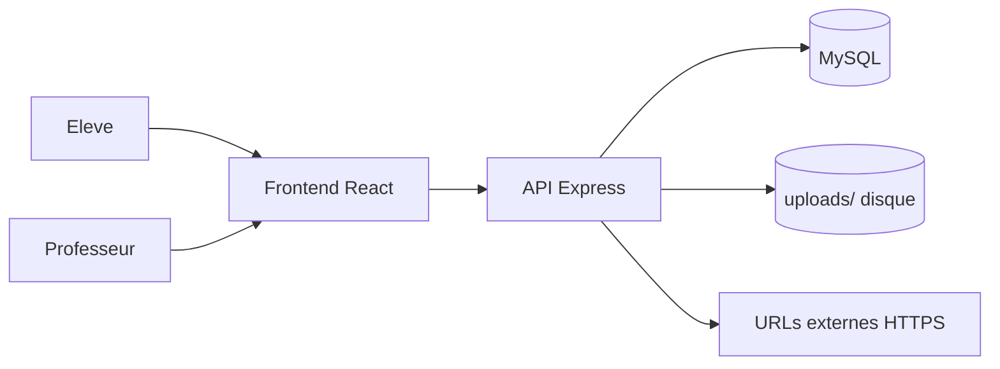

# Audit du système photos biodiversité

Date: 2026-03-23

## 1) Contexte et périmètre

Cet audit couvre les flux photos utilisés autour de la biodiversité ForetMap:

- Catalogue biodiversité (`plants`) avec liens photo externes.
- Photos de zone (`zone_photos`) stockées sur disque.
- Photos d'observations élèves (`observation_logs`) stockées sur disque.
- Photos de rapports de tâche (`task_logs`) stockées sur disque.

Fichiers analysés:

- Backend: `routes/plants.js`, `routes/zones.js`, `routes/observations.js`, `routes/tasks.js`, `lib/uploads.js`, `server.js`
- BDD/API: `sql/schema_foretmap.sql`, `docs/API.md`
- Frontend: `src/components/map-views.jsx`, `src/components/foretmap-views.jsx`, `src/components/tasks-views.jsx`, `src/utils/image.js`

## 2) Cartographie des flux actuels

### 2.1 Vue d'ensemble

### 2.2 Flux A - Catalogue biodiversité (liens externes, pas de binaire local)

- **Lecture**: `GET /api/plants` (ouvert).
- **Edition**: `POST|PUT|DELETE /api/plants` (protégé `requireTeacher`).
- **Validation**: contrôle d'URL dans `routes/plants.js` (`validateHttpsPhotoLinks`) sur champs `photo*`.
- **Stockage**: champs `photo`, `photo_species`, `photo_leaf`, `photo_flower`, `photo_fruit`, `photo_harvest_part` en `TEXT` MySQL.
- **Affichage**: `PlantMetaSections` (`foretmap-views.jsx`) : miniatures pour URLs **directes** (extension image, `Special:FilePath`, `/uploads/…`), pour pages **`/wiki/File:…`** (conversion en `Special:FilePath`), et pour URLs **`/wiki/Category:…`** via l’**API Commons** (`generator=categorymembers`, premier fichier image). Données seed : migration **`062_plants_nonvegetal_photo_filepath.sql`** (liens `Special:FilePath` pour faune / bactéries du jeu Excel).

Conclusion: ce flux est "URL-only". Il ne charge ni n'écrit de fichiers image côté serveur (sauf upload prof vers `/uploads/`).

### 2.3 Flux B - Photos de zone (binaire local)

- **Lecture méta**: `GET /api/zones/:id/photos` (ouvert), renvoie `image_url`.
- **Lecture image**: `GET /api/zones/:id/photos/:pid/data` (ouvert), `res.sendFile(...)`.
- **Upload**: `POST /api/zones/:id/photos` (prof), payload JSON `image_data` base64 + `caption`.
- **Suppression photo**: `DELETE /api/zones/:id/photos/:pid` (prof), suppression DB + fichier.
- **Suppression zone**: `DELETE /api/zones/:id` (prof), suppression DB uniquement sur `zone_photos`.

Note importante: la suppression de zone n'appelle pas explicitement `deleteFile` pour tous les fichiers existants.

### 2.4 Flux C - Photos d'observations élèves

- **Liste élève**: `GET /api/observations/student/:studentId`.
- **Liste prof**: `GET /api/observations/all` (prof).
- **Création**: `POST /api/observations` (élève), payload `imageData` base64 optionnel.
- **Lecture image**: `GET /api/observations/:id/image` (ouvert), `res.sendFile(...)`.
- **Suppression observation**: `DELETE /api/observations/:id` (route non protégée par middleware, contrôle métier implicite seulement).

### 2.5 Flux D - Photos de rapports de tâche

- **Création**: `POST /api/tasks/:id/done` (élève), payload `imageData` base64 optionnel.
- **Liste logs**: `GET /api/tasks/:id/logs` (ouvert).
- **Lecture image**: `GET /api/tasks/:id/logs/:logId/image` (ouvert), `res.sendFile(...)`.
- **Suppression log**: `DELETE /api/tasks/:id/logs/:logId` (prof).

### 2.6 Pipeline technique commun

- Compression client JPEG via canvas (`compressImage`, + variante locale dans `LogModal`).
- Transport en JSON base64 (`express.json` : défaut **100mb**, variable **`FORETMAP_JSON_BODY_LIMIT`**).
- Ecriture disque via `saveBase64ToDisk(relativePath, base64Data)`.
- Protection path traversal via `assertInsideUploads`.
- Exposition statique globale de `uploads/` via `app.use('/uploads', express.static(...))`.
- CSP autorise `img-src 'self' https: data: blob:`.

## 3) Matrice de risques priorisée

| ID | Risque | Gravité | Probabilité | Impact | Observations |
|---|---|---|---|---|---|
| R1 | Fichiers orphelins lors de suppression de zone | Haute | Elevée | Coût stockage, dérive opérationnelle | `DELETE /api/zones/:id` supprime DB `zone_photos` sans purge fichier explicite |
| R2 | Contrôle insuffisant du contenu image uploadé | Haute | Moyenne | Sécurité, stabilité, contenu non conforme | décodage base64 sans validation MIME/magic bytes/taille post-décodage |
| R3 | Accès large aux images via routes GET ouvertes | Haute | Moyenne | Confidentialité des photos élèves | plusieurs routes image lisibles sans auth applicative |
| R4 | Upload base64 JSON coûteux en CPU/mémoire | Moyenne | Elevée | UX mobile, latence, charge serveur | double conversion client/serveur, limite 10 MB par requête |
| R5 | Hétérogénéité pipeline compression frontend | Moyenne | Moyenne | Qualité/maintenance | `compressImage` + logique parallèle dans `tasks-views.jsx` |
| R6 | Gouvernance faible des URLs externes `plants.photo*` | Moyenne | Moyenne | Qualité disponibilité, conformité source | HTTPS requis mais pas d'allowlist/check santé des liens |
| R7 | Modération incomplète des photos élèves | Moyenne | Moyenne | Qualité pédagogique, conformité interne | route prof `/api/observations/all` présente, pas de workflow de validation |
| R8 | Exposition doublonnée des images locales | Basse | Moyenne | Surface d'attaque accrue | routes `sendFile` + statique `/uploads` |

## 4) Exigences non fonctionnelles cibles

Pour cadrer les décisions techniques:

- **Sécurité**: contrôle d'accès explicite par type de photo (publique, privée classe, prof uniquement).
- **Intégrité média**: validation type + taille + format avant persistance.
- **Performance mobile**: upload cible < 3 s sur réseau correct pour photo standard.
- **Exploitation**: zéro fichier orphelin sur suppression métier nominale.
- **Traçabilité**: journaliser créations/suppressions médias sensibles.
- **Scalabilité**: architecture compatible montée en charge (volume photos, lecture simultanée).

## 5) Systèmes alternatifs (comparatif)

## Option A - Disque local durci (incrémental)

Description:

- Conserver `uploads/` local.
- Ajouter validation MIME + taille réelle après décodage.
- Uniformiser la suppression de fichiers et le nettoyage d'orphelins.
- Poser des headers cache/etag cohérents.

Avantages:

- Faible effort initial.
- Très peu de rupture fonctionnelle.
- Coût infra quasi nul.

Limites:

- Scalabilité limitée (mono-instance/disque local).
- Backups et reprise incident à formaliser.

Effort estimé: **Faible à moyen**

## Option B - Stockage objet (S3/R2/MinIO) + métadonnées SQL

Description:

- Binaires déplacés vers objet storage.
- DB conserve clés objet, métadonnées, ownership et statuts.
- Lecture via URL signée temporaire ou proxy API.

Avantages:

- Scalabilité/fiabilité supérieures.
- Bonne compatibilité CDN.
- Nettoyage lifecycle automatisable.

Limites:

- Complexité sécurité et opérations plus élevée.
- Migration des fichiers existants à orchestrer.

Effort estimé: **Moyen à élevé**

## Option C - Workflow de modération média

Description:

- Introduire états `pending|approved|rejected` pour photos élèves/zones selon cas.
- Vue prof de revue et validation.

Avantages:

- Gouvernance pédagogique forte.
- Réduction du risque de contenu inadapté publié.

Limites:

- Charge humaine de modération.
- Complexité UX et règles métier accrues.

Effort estimé: **Moyen**

## Option D - Catalogue biodiversité gouverné "URL-only"

Description:

- Conserver `plants.photo*` en URL externes.
- Ajouter policy de domaines autorisés + contrôle périodique de santé des liens.

Avantages:

- Pas de stockage binaire à gérer pour le catalogue.
- Simplicité de saisie côté professeur.

Limites:

- Dépendance à des tiers externes.
- Qualité visuelle et disponibilité variables.

Effort estimé: **Faible**

## 6) Recommandation de trajectoire

### Phase 1 (court terme, 2-4 semaines) - sécuriser l'existant

Cible: Option A + D minimal

- Ajouter validation stricte upload (format, taille décodée, rejet explicite).
- Corriger suppression pour éviter orphelins (notamment suppression de zone).
- Clarifier et renforcer règles d'accès aux routes image sensibles.
- Unifier pipeline compression frontend.
- Ajouter contrôle qualité des URLs `plants.photo*` (allowlist + check périodique).

Succès phase 1:

- Diminution nette des erreurs upload.
- Absence d'orphelins sur scénarios de suppression couverts.
- Latence upload mesurée et stable sur mobile.

### Phase 2 (moyen terme, 1-2 trimestres) - industrialiser

Cible: Option B, Option C selon besoin pédagogique

- Migrer binaires vers stockage objet.
- Introduire stratégie d'accès (URL signées ou proxy).
- Ajouter modération workflow si gouvernance demandée.
- Mettre en place observabilité média (volumes, erreurs, délais, taux rejet).

Succès phase 2:

- Scalabilité lecture/écriture améliorée.
- Coût opérationnel prévisible.
- Politique d'accès média homogène.

## 7) Plan d'actions concret

1. **Cartographie validée**: figer le modèle d'accès par type de photo (public/prof/élève propriétaire).
2. **Hardening upload**: ajouter garde-fous serveur (MIME/magic bytes/taille).
3. **Fiabilisation suppression**: purge systématique fichiers + job de réconciliation périodique.
4. **Performance**: préparer migration `multipart/form-data` ou flux objet signé.
5. **Catalogue**: instaurer allowlist et vérification automatique des liens photo externes.
6. **Roadmap infra**: chiffrer migration stockage objet, lotir par flux (`zone_photos` puis `observation_logs` puis `task_logs`).

## 8) Décision recommandée

Décision proposée:

- **Immédiat**: Option A (durcissement) + Option D (gouvernance des liens externes).
- **Cible**: Option B progressive, déclenchée après stabilisation phase 1.
- **Conditionnelle**: Option C si l'équipe pédagogique valide le besoin de modération explicite.

Cette trajectoire minimise le risque court terme tout en préparant une architecture plus robuste à moyen terme.
