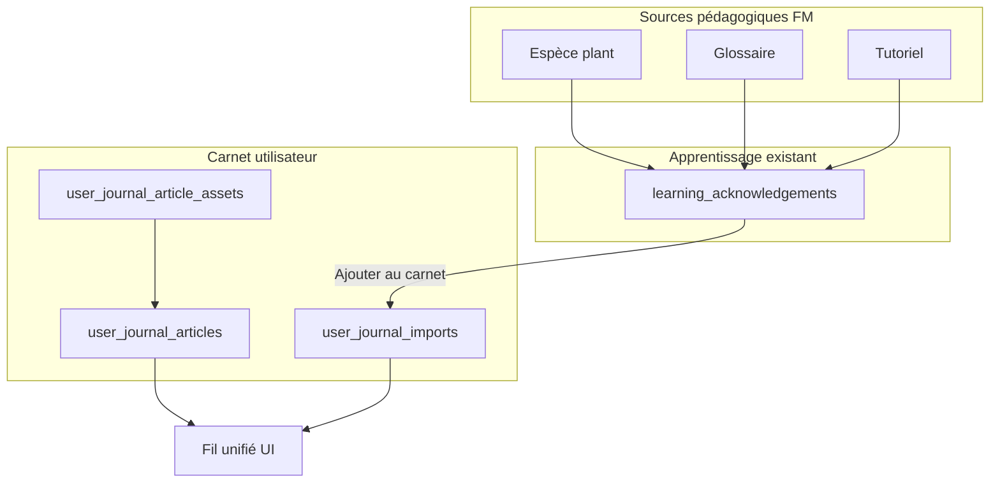

# Plan — Carnet ForetMap à parité totale avec « Mon journal » GL

**Statut :** livré (implémentation 2026-09-12)
**Objectif :** le carnet d’observation ForetMap offre la **même richesse fonctionnelle** que le carnet personnel GL (`docs/GL_CARNET_JOUEUR.md`), pour les comptes **élève**, **visiteur connecté** et **prof de classe** (carnet personnel), avec imports **uniquement après apprentissage / découverte**.

Référence fonctionnelle GL : articles · multi-photos · auto-save · encarts inline · imports catalogue · épinglage · recherche / filtre / tri · lecture staff · export `.md`.

---

## 1. Périmètre fonctionnel (parité totale)

| Capacité GL « Mon journal »                            | Cible ForetMap                                                                  |
| ------------------------------------------------------ | ------------------------------------------------------------------------------- |
| Fil unifié articles + imports                          | Oui                                                                             |
| Article : titre optionnel + markdown                   | Oui                                                                             |
| Multi-photos / article « média seul »                  | Oui                                                                             |
| Auto-save + indicateur                                 | Oui (`useDebouncedAutoSave`, `AutoSaveStatus`)                                  |
| Encarts inline dans le markdown                        | Oui (types FM : `plant`, `glossary`, `tutorial`, + stubs modules FM utiles)     |
| Import catalogue après « appris »                      | Oui (`plant`, `glossary`, `tutorial`)                                           |
| Épinglage article / import                             | Oui                                                                             |
| Recherche / filtre (tout \| articles \| imports) / tri | Oui (client)                                                                    |
| Lecture staff                                          | Oui (prof / admin : périmètre `observations.read.*` ; panneau Stats enrichi)    |
| Export `.md` (lecture staff)                           | Oui                                                                             |
| Module activable                                       | Oui (`modules.observations_enabled`, libellé « Carnet »)                        |
| Limites optionnelles chars / assets                    | Oui (réglages FM miroir GL, défaut illimité)                                    |
| Zone (spécificité forêt)                               | **Conservée** : zone optionnelle sur un article (hors modèle GL, non bloquante) |

**Hors périmètre :** visite anonyme sans compte ; journal de _partie_ GL ; types GL-only (`spell`, `feuillet`, `lore_glossary`, `ecosystem`, `content_page`).

**Public écriture :**

- Élève (`eleve_*`) — inchangé, enrichi.
- Visiteur **connecté** (`visiteur`) — carnet personnel.
- Prof de classe (`prof_classe`) — **son propre** carnet (plus le blocage UI actuel).

---

## 2. Principes d’architecture

1. **Isolement produits** : pas d’appel aux tables / routes `gl_*` depuis le carnet FM. Miroir du modèle GL dans le domaine ForetMap.
2. **Réutilisation maximale** de `src/shared/` (markdown, images, auto-save, `LearningAcknowledgeButton`) et des patterns de `lib/glPlayerJournal.js` / UI `GLPlayerJournal*`.
3. **Appris déjà en place** côté FM : `learning_acknowledgements` + `FM_MARKABLE` = `{ tutorial, plant, glossary }` — ne pas réinventer ; brancher l’import dessus.
4. **Compatibilité** : migrer les `observation_logs` existantes vers des articles (pas de perte de contenu).

---

## 3. Données

### 3.1 Nouvelles tables (migration `237_*` ou suivant libre)

Noms proposés (préfixe clair, hors `gl_*`) :

**`user_journal_articles`**

- `id`, `user_id` (FK `users`, CASCADE)
- `title` VARCHAR(255) NULL
- `body_markdown` MEDIUMTEXT NOT NULL
- `zone_id` NULL (FK zones, SET NULL) — ancrage forêt
- `pinned` TINYINT(1) NOT NULL DEFAULT 0
- `created_at`, `updated_at`
- Index `(user_id, created_at)`, `(user_id, pinned)`

**`user_journal_article_assets`**

- `id`, `article_id`, `user_id`, `asset_path`, `mime_type`, `byte_size`, `created_at`
- CASCADE sur article / user
- Stockage disque : `/uploads/user-journal/{userId}/…` (miroir `gl-player-journal`)

**`user_journal_imports`**

- `id`, `user_id`, `resource_type` ENUM/VARCHAR (`plant` \| `glossary` \| `tutorial`)
- `resource_ref` VARCHAR, `title` VARCHAR NULL (titre figé = repli)
- `pinned`, `created_at`
- UNIQUE `(user_id, resource_type, resource_ref)`

### 3.2 Migration des observations

Pour chaque ligne `observation_logs` :

1. Créer un article : `body_markdown = content`, `zone_id`, `user_id = student_id`, horodatages repris.
2. Si `image_path` : créer un asset + éventuellement une image markdown pointant vers le nouveau chemin (ou conserver le chemin après copie/renommage contrôlé).
3. Ne pas dropper `observation_logs` dans le même lot que la bascule UI : garder la table en lecture seule le temps de valider, puis migration de nettoyage ultérieure **ou** drop dans le même lot si les tests de reprise sont verts (préférence : **copie + bascule API**, drop dans un lot suivant court).

### 3.3 Réglages

Miroir GL dans le catalogue settings FM :

- `observations.journal_max_chars` (défaut `0` = illimité)
- `observations.journal_max_assets` (défaut `0`)

Module existant `ui.modules.observations_enabled` inchangé (garde d’accès).

### 3.4 Permissions

Réutiliser `observations.read.all|group` et `observations.manage.all|group` :

- **Lecture staff** d’un carnet = articles + imports de l’utilisateur cible (élève / visiteur), dans le périmètre groupe.
- **Carnet d’un `prof_classe`** : personnel ; les autres profs ne le lisent pas via le panneau « carnets élèves » (sauf admin / `read.all` si on aligne explicitement — **décision plan : seul le propriétaire édite ; `read.all` peut lire tout user_id pour cohérence admin**).
- `prof_classe` : pas besoin d’une nouvelle permission pour _écrire son_ carnet (auth propriétaire).

---

## 4. Backend

### 4.1 Module métier

Nouveau : [`lib/fmUserJournal.js`](lib/fmUserJournal.js) — calqué sur [`lib/glPlayerJournal.js`](lib/glPlayerJournal.js) :

- CRUD articles, pin, assets (compression via helpers existants)
- Imports : existence ressource + **accusé requis** (`learning_acknowledgements` / `lib/shared/learningAckCore.js`)
- Validation encarts FM + `POST …/embeds/resolve` (titres)
- Strip des images hors préfixe owner à la sauvegarde
- Résolution titre import à l’affichage (repli = titre figé)

Nouveau routeur : [`routes/user-journal.js`](routes/user-journal.js) (ou évolution lourde de [`routes/observations.js`](routes/observations.js) — **choix retenu : nouveau routeur `/api/user-journal`**, déprécier progressivement `/api/observations` avec alias de compat si besoin court).

### 4.2 Contrat API (miroir GL)

| Méthode | Endpoint                           | Notes                                                       |
| ------- | ---------------------------------- | ----------------------------------------------------------- |
| GET     | `/api/user-journal/me`             | `{ limits, articles[], imports[] }`                         |
| GET     | `/me/imports/refs`                 | léger pour boutons « déjà importé »                         |
| POST    | `/me/articles`                     | `{ title?, bodyMarkdown?, zoneId? }`                        |
| PUT     | `/me/articles/:id`                 | titre, corps, zone                                          |
| PUT     | `/me/articles/:id/pin`             | `{ pinned }`                                                |
| DELETE  | `/me/articles/:id`                 | cascade assets disque                                       |
| POST    | `/me/articles/:id/assets`          | `{ imageData }`                                             |
| DELETE  | `/me/articles/:id/assets/:assetId` |                                                             |
| POST    | `/me/imports`                      | `{ resourceType, resourceRef, title? }` — 403 si non appris |
| PUT     | `/me/imports/:id/pin`              |                                                             |
| DELETE  | `/me/imports/:id`                  |                                                             |
| POST    | `/embeds/resolve`                  | `{ embeds:[{type,ref}] }` → titres                          |
| GET     | `/users/:userId`                   | lecture staff (`observations.read.*` + périmètre)           |

Auth : `requireAuth` ; module off → **503** (comme GL).  
Propriétaire = `auth.userId` (élève, visiteur ou enseignant `prof_classe`) — **supprimer** le filtre `user_type = 'student'` actuel.

### 4.3 Encarts FM

Types validés serveur :

| Type          | Réf                                                              | Source        |
| ------------- | ---------------------------------------------------------------- | ------------- |
| `plant`       | id / code plante                                                 | table plantes |
| `glossary`    | code terme                                                       | glossaire FM  |
| `tutorial`    | id tuto                                                          | tutoriels     |
| `module_stub` | clés FM (`plants`, `glossary`, `tutorials`, `foodweb`, `visit`…) | allowlist     |

Généraliser légèrement [`src/shared/platform/markdown.js`](src/shared/platform/markdown.js) : aujourd’hui figé sur `gl-journal-embed` / types GL. Introduire une couche neutre **`journal-embed`** (classe + `data-embed-type` / `data-ref`) **tout en acceptant encore** les balises `gl-journal-embed` pour ne pas casser GL. FM écrit le format neutre ; GL peut rester sur son format actuel dans un premier temps (double acceptation sanitize).

### 4.4 Compat `/api/observations`

- Pendant la transition : soit proxies vers le journal, soit 410 documenté après bascule front.
- Realtime : étendre `emitObservationsChanged` → événement domaine `user-journal` (ou réutiliser le canal observations pour limiter la casse Socket.IO).

---

## 5. Frontend

### 5.1 Accès shell

- [`src/App.jsx`](src/App.jsx) : retirer `&& !isClassTeacher` sur `observationsEnabled`.
- S’assurer que `studentForUi` / session fournit un `id` pour visiteur et `prof_classe` (enseignant : utiliser `sessionUser.id` comme owner du carnet).
- Gardes [`useTabNavigationGuards.js`](src/hooks/useTabNavigationGuards.js) : onglet `notebook` autorisé pour `isVisitor` et `prof_classe` si module on.

### 5.2 Vue carnet

Remplacer le cœur de `ObservationNotebook` par une UI calquée sur :

- [`GLPlayerJournalView.jsx`](src/gl/components/GLPlayerJournalView.jsx)
- [`GLPlayerJournalArticleCard.jsx`](src/gl/components/GLPlayerJournalArticleCard.jsx)
- [`GLPlayerJournalImportCard.jsx`](src/gl/components/GLPlayerJournalImportCard.jsx)
- [`GLPlayerJournalEmbedPicker.jsx`](src/gl/components/GLPlayerJournalEmbedPicker.jsx)
- [`GLPlayerJournalReadModal.jsx`](src/gl/components/GLPlayerJournalReadModal.jsx)

Implémentation : composants FM dédiés sous `src/components/journal/` (chrome forêt), **pas** d’import des composants `GL*` (isolement). Extraire éventuellement des helpers purs partagés (tri/filtre fil, labels d’import) vers `src/shared/journal/` si duplication bit-à-bit.

Champ **zone** : sélecteur optionnel sur la carte article (spécificité FM).

### 5.3 Learn + Import

Extraire un composant partagé du pattern [`GLLearnAndImport.jsx`](src/gl/components/GLLearnAndImport.jsx) :

- `src/shared/components/LearnAndImport.jsx` (API injectée : `api` vs `apiGL`, chemins mark / imports)
- Brancher sur :
  - biodiversité / fiche espèce ([`PlantSpeciesDiscoveryAcknowledge`](src/components/PlantSpeciesDiscoveryAcknowledge.jsx))
  - glossaire ([`GlossaryTermLearnedAcknowledge`](src/components/pedago/GlossaryTermLearnedAcknowledge.jsx))
  - tutoriels ([`TutorialReadAcknowledge`](src/components/TutorialReadAcknowledge.jsx))

Flux : consulté → Marquer appris (gating QCM éventuel déjà en place) → **Ajouter au carnet** → entrée dans le fil.

### 5.4 Lecture prof

Enrichir [`TeacherObservationsPanel.jsx`](src/components/stats/TeacherObservationsPanel.jsx) :

- Markdown rendu sécurisé, galerie photos, imports titrés + deep-link
- Modal lecture + **export `.md`** (comme MJ GL)
- Realtime refresh

---

## 6. Documentation

Même lot :

- [`docs/reference/foretmap/pedagogie-quiz-glossaire-reseau.md`](docs/reference/foretmap/pedagogie-quiz-glossaire-reseau.md) — section Carnet au présent (parité, rôles, imports)
- [`docs/reference/foretmap/presentation.md`](docs/reference/foretmap/presentation.md), [`comptes-roles-et-groupes.md`](docs/reference/foretmap/comptes-roles-et-groupes.md), [`stats-forum-et-suivi.md`](docs/reference/foretmap/stats-forum-et-suivi.md)
- [`docs/API.md`](docs/API.md) — contrat `/api/user-journal`
- Doc technique courte `docs/FORETMAP_CARNET.md` (miroir allégé de `GL_CARNET_JOUEUR.md`)
- [`CHANGELOG.md`](CHANGELOG.md) sous `[Non publié]`
- Ce fichier : passer le statut à **Livré** en fin d’implémentation

---

## 7. Tests (même lot)

| Couche     | Fichiers / scénarios                                                                                                                                                                                                |
| ---------- | ------------------------------------------------------------------------------------------------------------------------------------------------------------------------------------------------------------------- |
| API        | `tests/user-journal.test.js` — CRUD, pin, assets, import 403 sans ack / 201 avec ack, embeds, lecture staff, module off 503, owner prof_classe & visiteur                                                           |
| Lib        | `tests/fm-user-journal-lib.test.js` — validation encarts, migration mapping obs→article                                                                                                                             |
| UI         | `tests-ui/components/UserJournal*.test.jsx` — fil, filtre, import card                                                                                                                                              |
| e2e        | étendre `e2e/observations-notebook.spec.js` (ou `e2e/user-journal.spec.js`) : élève article+photo ; visiteur écrit ; prof_classe onglet + écriture ; import après appris espèce/glossaire/tuto ; lecture prof Stats |
| Régression | garder un smoke sur anciennes observations migrées                                                                                                                                                                  |

Commandes mini : `npm test` (fichier dédié), `npm run test:ui`, `npm run test:e2e` sur le spec carnet ; `npm run lint` + `format:check` avant push.

---

## 8. Découpage de livraison suggéré

Lot unique préférable pour la parité « totale » (sinon carnet à moitié) ; si besoin de PR plus petites :

| PR                        | Contenu                                                                                                                |
| ------------------------- | ---------------------------------------------------------------------------------------------------------------------- |
| **A — Socle**             | Migration tables + `lib/fmUserJournal` + routes `/api/user-journal` + migration données `observation_logs` + tests API |
| **B — UI carnet**         | Vue fil / articles / photos / pin / search + accès visiteur & prof_classe + e2e écriture                               |
| **C — Imports & encarts** | LearnAndImport partagé + picker encarts + resolve + panneau prof + export + doc référence                              |

Ordre de merge : A → B → C. Version : **ne pas bumper** `package.json` (bump auto à la fusion) ; entrée CHANGELOG dès PR A.

---

## 9. Risques & points d’attention

- **Owner enseignant** : aujourd’hui l’API refuse tout non-`student` — à corriger explicitement.
- **Markdown shared GL-couplé** : double format d’encart le temps de la généralisation.
- **Images observations** : chemins `observations/…` → `user-journal/…` (copie fichier + BDD).
- **Panneau Stats** : plafond actuel 100 entrées — décider d’un plafond unifié articles+imports (ex. 500 côté propriétaire, 100 côté vue groupe agrégée, aligné doc actuelle).
- **Doublon conceptuel** : ne pas confondre avec `user_plant_observation_events` (biodiversité « espèce observée ») — hors carnet.

---

## 10. Critères de done

- [ ] Visiteur connecté et prof_classe voient l’onglet Carnet et y écrivent
- [ ] Parité fonctionnelle listée §1 couverte (hors types GL-only)
- [ ] Import refusé sans accusé, accepté après
- [ ] Anciennes observations visibles comme articles
- [ ] Doc référence + API + tests + CHANGELOG à jour
- [ ] Aucun couplage runtime FM ↔ tables/routes GL
      `)

## 9. Noyau commun ForetMap / G&L (13 septembre 2026)

> Réalisé dans la PR #457, à la suite de l'audit du code (`docs/AUDIT_CODE_2026-09-13.md`,
> §4.5 : trois paires de composants recopiées, 235 lignes divergentes sur la carte d'article).

### 9.1 Principe : la logique est commune, l'habillage reste au produit

Le contrat HTTP des deux carnets est identique par construction (§4.2 ci-dessus). Tout ce qui
ne dépend pas du produit vit désormais dans **`src/shared/journal/`** ; chaque produit ne
fournit plus que trois choses : son **client HTTP et son préfixe de routes**, ses
**métadonnées de types d'import** (quels onglets, quelles icônes), et son **habillage**
(classes, composant bouton, aide contextuelle).

| Module partagé                               | Rôle                                                                                                                                                                                                                                                                                                                                            |
| -------------------------------------------- | ----------------------------------------------------------------------------------------------------------------------------------------------------------------------------------------------------------------------------------------------------------------------------------------------------------------------------------------------- |
| `journalAdapter.js` — `createJournalAdapter` | Fabrique l'interface `JournalAdapter` (`fetchJournal`, `createArticle`, `updateArticle`, `addArticleAsset`, `removeArticleAsset`, `deleteArticle`, `pinArticle`, `deleteImport`, `pinImport`, `importResource`, `resolveEmbeds`, `fetchSubjectJournal`) à partir d'un client, d'un préfixe et du segment de lecture staff (`users` / `players`) |
| `journalFeed.js` — `buildJournalTimeline`    | Fil unifié articles + imports : filtre par type, recherche, épinglés d'abord, ordre chronologique — fonction pure, testée sans rendu                                                                                                                                                                                                            |
| `useJournalFeed.js`                          | État et actions du fil (chargement avec garde anti-course, création, suppression, épinglage, filtres)                                                                                                                                                                                                                                           |
| `useJournalArticleEditor.js`                 | Toute la logique d'un article : auto-save titre/corps (+ champs produit), illustrations, encarts au curseur, aperçu, états suppression/épinglage                                                                                                                                                                                                |
| `JournalImportCard.jsx`                      | Carte d'import unique, paramétrée par `meta` (types) et `ui` (habillage)                                                                                                                                                                                                                                                                        |
| `JournalFeedToolbar.jsx`                     | Recherche / filtre / tri, mêmes libellés d'accessibilité dans les deux produits                                                                                                                                                                                                                                                                 |
| `JournalEmbedPicker.jsx`                     | Dialogue « Insérer un élément », paramétré par un **registre de types** (`JOURNAL_EMBED_TYPES` : champ texte / nombre / liste / référence fixe, suggestions, aide) et par `ui` (champ, liste, boutons du produit)                                                                                                                               |
| `JournalReadModal.jsx` + `journalExport.js`  | Lecture d'un carnet par le professeur / MJ : comptages, articles datés avec volumes, illustrations, éléments importés filtrables par type (dès deux types présents), export Markdown ; état vide et erreur                                                                                                                                      |
| `useJournalEmbedTitles.js`                   | Hydratation des titres d'encarts : reconnaît les **deux dialectes** (`.journal-embed[data-ref]` → `data-journal-title`, `.gl-journal-embed[data-gl-ref]` → `data-gl-title`), résolveur fourni par l'adaptateur                                                                                                                                  |
| `JournalImportButton.jsx`                    | Bouton « Ajouter au carnet » : états non appris / ajout / ajouté / erreur ; le produit fournit sa garde de session (`canImport`), son adaptateur et ses textes                                                                                                                                                                                  |

Côté produit :

| ForetMap                                                                                             | G&L                                                                                                          | Contenu                                                                                                                                                        |
| ---------------------------------------------------------------------------------------------------- | ------------------------------------------------------------------------------------------------------------ | -------------------------------------------------------------------------------------------------------------------------------------------------------------- |
| `src/services/userJournalAdapter.js`                                                                 | `src/gl/services/playerJournalAdapter.js`                                                                    | `createJournalAdapter({ request: api \| apiGL, basePath, subjectsSegment })`                                                                                   |
| `src/components/journal/journalUi.js`                                                                | `src/gl/components/journalUi.js`                                                                             | préfixe de classes, surface, bouton (`.btn` / `GLButton`), champ / liste (`GLField` / `GLSelect`), classes de dialogue                                         |
| `src/utils/fmJournalMeta.js` (`JOURNAL_EMBED_TYPES`)                                                 | `src/gl/utils/glPlayerJournalEmbed.js` (`JOURNAL_EMBED_TYPES`)                                               | registre des encarts insérables (fiche / terme / tutoriel / module en liste — sort avec suggestions du chapitre / espèce / terme / chapitre / module narratif) |
| `src/utils/fmJournalMeta.js`                                                                         | `src/gl/utils/glJournalImportMeta.js`                                                                        | types d'import (`plant`, `glossary`, `tutorial` / `species`, `feuillet`, …)                                                                                    |
| `UserJournalView`, `UserJournalArticleCard`                                                          | `GLPlayerJournalView`, `GLPlayerJournalArticleCard`                                                          | rendu seul : textes, aide contextuelle (`HelpPanel` section `journal` / `GLHelpPanel` `tab:my-journal`), champ **zone** (FM) / **sorts du chapitre** (GL)      |
| `UserJournalEmbedPicker`, `UserJournalReadModal`, `FmJournalImportButton`, `useFmJournalEmbedTitles` | `GLPlayerJournalEmbedPicker`, `GLPlayerJournalReadModal`, `GLJournalImportButton`, `useGlJournalEmbedTitles` | enveloppes de quelques lignes : registre / adaptateur / textes / thème du produit, rien d'autre                                                                |

### 9.2 Ce que cela change pour un correctif

Un défaut du fil, de l'auto-save, de l'ajout d'image ou de l'insertion d'encart se corrige
**une fois**, dans `src/shared/journal/`, et vaut pour les deux produits ; un test Vitest du
noyau (`tests-ui/shared/journalFeed.test.js`) et deux tests miroirs par produit
(`tests-ui/components/journal/`, `tests-ui/gl/GLPlayerJournal*`) tiennent la parité. Les
libellés (« Mon carnet » / « Mon journal », textes d'introduction et d'état vide) restent
volontairement propres à chaque produit.

### 9.3 Fin de la mutualisation (13 septembre 2026, même PR)

Les cinq points laissés ouverts au premier passage sont traités :

1. **Sélecteur d'encarts** → `JournalEmbedPicker` partagé, paramétré par le registre
   `JOURNAL_EMBED_TYPES` de chaque produit. Aucune liste de types dans le composant : ajouter un
   encart, c'est ajouter une ligne au registre (test miroir
   `tests-ui/components/journal/UserJournalEmbedPicker.test.jsx`).
2. **Modale de lecture** → `JournalReadModal` partagé. ForetMap est **aligné sur la vue MJ** :
   comptages, dates et volumes par article, illustrations en vignettes, éléments importés avec
   filtre par type (dès deux types présents) et compteur dans le titre de section, état vide,
   export Markdown enrichi (dates, comptages, zone). La zone reste une ligne produit
   (`articleExtraLine`). Le MJ gagne au passage les vignettes d'illustrations, que la modale
   G&L ignorait.
3. **Hydratation des titres** → `useJournalEmbedTitles(html, adapter.resolveEmbeds)` ; les deux
   dialectes d'encart sont reconnus quel que soit le produit, chacun recevant **son** attribut
   de titre. **Boutons d'import** → `JournalImportButton` (garde de session, adaptateur et
   textes fournis par le produit) ; `FmLearnAndImportSlot` et les cinq consommateurs G&L sont
   inchangés.
4. **Aide contextuelle** → nouvelle section d'aide `journal` (« Aide carnet ») : panneau `?`
   dans l'en-tête de « Mon carnet », textes dans `src/constants/help.js` et
   `data/help.default.json` (miroir vérifié par `tests/help-corpus-olu.test.js`), éditables dans
   l'administration de l'aide (`ForetMapHelpContentAdminPanel`, « Mon carnet »).
5. **Compteur de caractères** : aligné dès le premier passage.

Ce qui reste **volontairement** propre à chaque produit : les libellés (« carnet » / « journal »),
la garde de session (`getAuthToken()` / joueur G&L), les métadonnées de types, l'habillage.
Les anciens fichiers produit sont conservés comme enveloppes pour ne pas déplacer les imports
des consommateurs (`TeacherObservationsPanel`, `GLStatsView`, fiches espèces / glossaire /
tutoriels).
